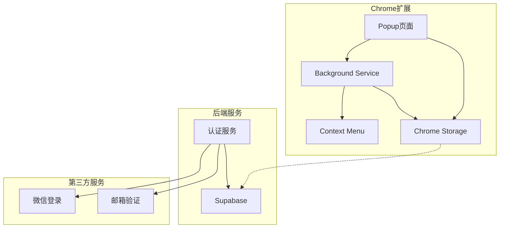
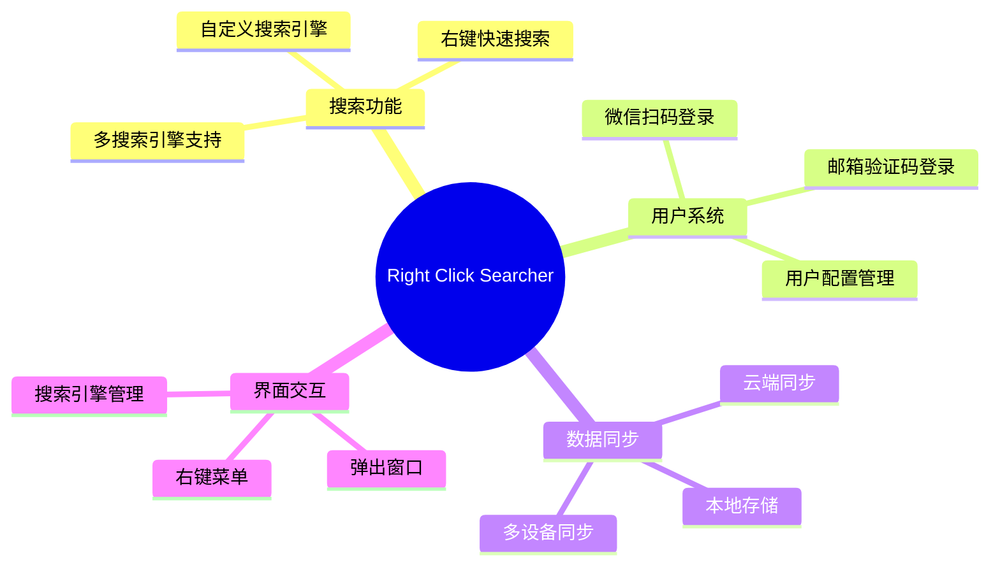
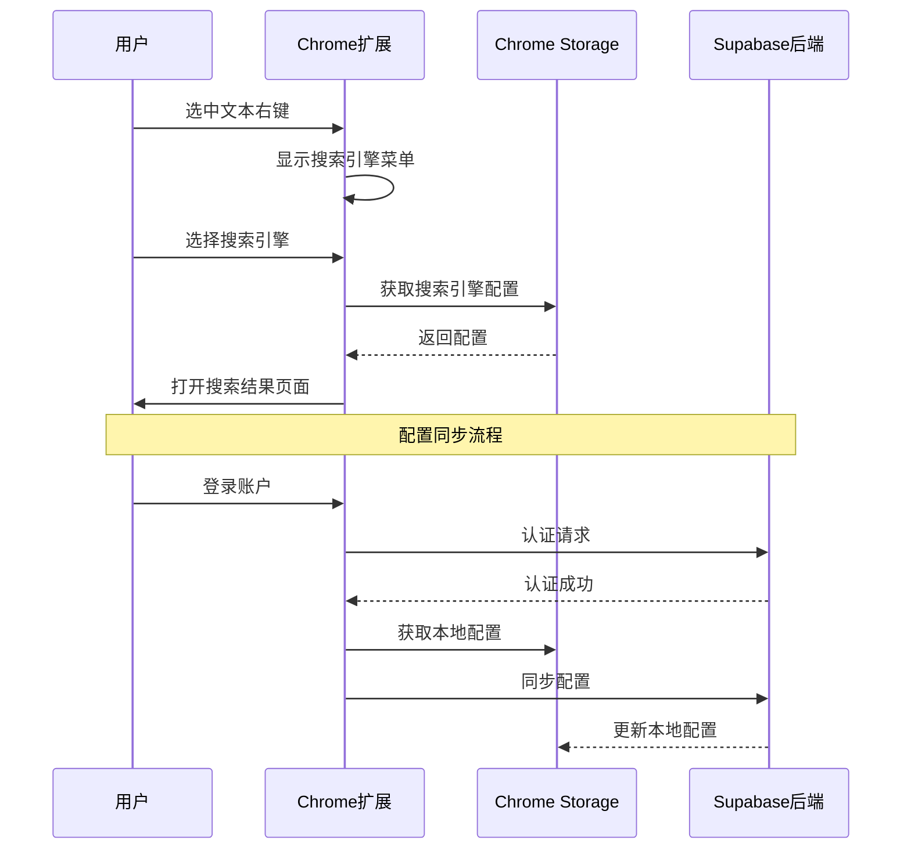
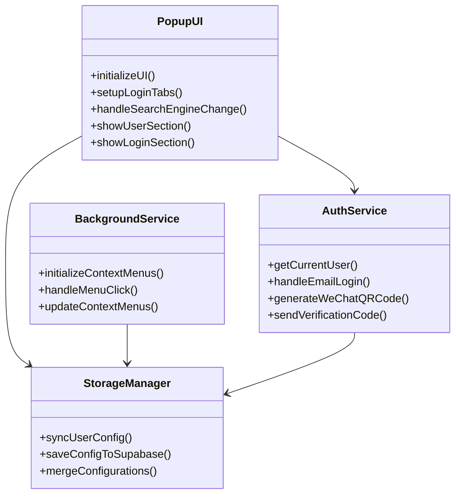
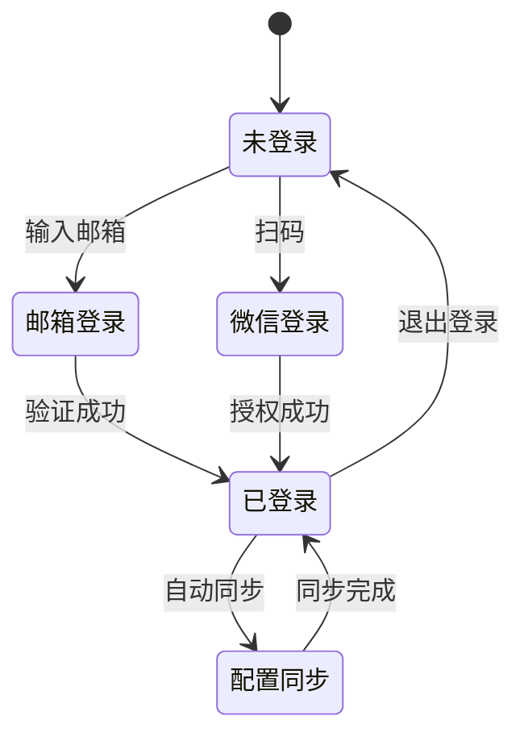
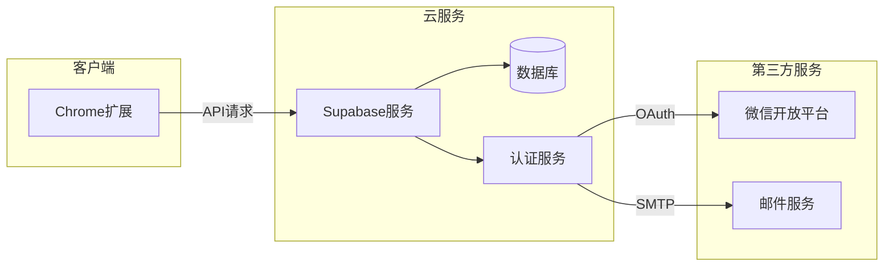

# Right Click Searcher - 技术架构图

## 系统架构图

```mermaid
graph TB
    subgraph Chrome扩展
        P[Popup页面] --> B[Background Service]
        B --> CM[Context Menu]
        P --> Storage[Chrome Storage]
        B --> Storage
    end

    subgraph 后端服务
        Storage -.-> Supabase[Supabase]
        Auth[认证服务] --> Supabase
    end

    subgraph 第三方服务
        Auth --> WX[微信登录]
        Auth --> Email[邮箱验证]
    end
```

## 功能需求图

```mermaid
mindmap
  root((Right Click Searcher))
    搜索功能
      多搜索引擎支持
      右键快速搜索
      自定义搜索引擎
    用户系统
      微信扫码登录
      邮箱验证码登录
      用户配置管理
    数据同步
      本地存储
      云端同步
      多设备同步
    界面交互
      弹出窗口
      右键菜单
      搜索引擎管理
```

## 数据流程图

```mermaid
sequenceDiagram
    participant User as 用户
    participant Extension as Chrome扩展
    participant Storage as Chrome Storage
    participant Backend as Supabase后端

    User->>Extension: 选中文本右键
    Extension->>Extension: 显示搜索引擎菜单
    User->>Extension: 选择搜索引擎
    Extension->>Storage: 获取搜索引擎配置
    Storage-->>Extension: 返回配置
    Extension->>User: 打开搜索结果页面

    Note over User,Backend: 配置同步流程
    User->>Extension: 登录账户
    Extension->>Backend: 认证请求
    Backend-->>Extension: 认证成功
    Extension->>Storage: 获取本地配置
    Extension->>Backend: 同步配置
    Backend-->>Storage: 更新本地配置
```

## 组件结构图

```mermaid
classDiagram
    class PopupUI {
        +initializeUI()
        +setupLoginTabs()
        +handleSearchEngineChange()
        +showUserSection()
        +showLoginSection()
    }

    class BackgroundService {
        +initializeContextMenus()
        +handleMenuClick()
        +updateContextMenus()
    }

    class StorageManager {
        +syncUserConfig()
        +saveConfigToSupabase()
        +mergeConfigurations()
    }

    class AuthService {
        +getCurrentUser()
        +handleEmailLogin()
        +generateWeChatQRCode()
        +sendVerificationCode()
    }

    PopupUI --> StorageManager
    PopupUI --> AuthService
    BackgroundService --> StorageManager
    AuthService --> StorageManager
```

## 状态流转图

```mermaid
stateDiagram-v2
    [*] --> 未登录
    未登录 --> 邮箱登录: 输入邮箱
    未登录 --> 微信登录: 扫码
    邮箱登录 --> 已登录: 验证成功
    微信登录 --> 已登录: 授权成功
    已登录 --> 配置同步: 自动同步
    配置同步 --> 已登录: 同步完成
    已登录 --> 未登录: 退出登录
```

## 部署架构图

```mermaid
graph LR
    subgraph Client[客户端]
        CE[Chrome扩展]
    end

    subgraph Cloud[云服务]
        SB[Supabase服务]
        DB[(数据库)]
        Auth[认证服务]
    end

    subgraph ThirdParty[第三方服务]
        WX[微信开放平台]
        ES[邮件服务]
    end

    CE -->|API请求| SB
    SB --> DB
    SB --> Auth
    Auth -->|OAuth| WX
    Auth -->|SMTP| ES
```
